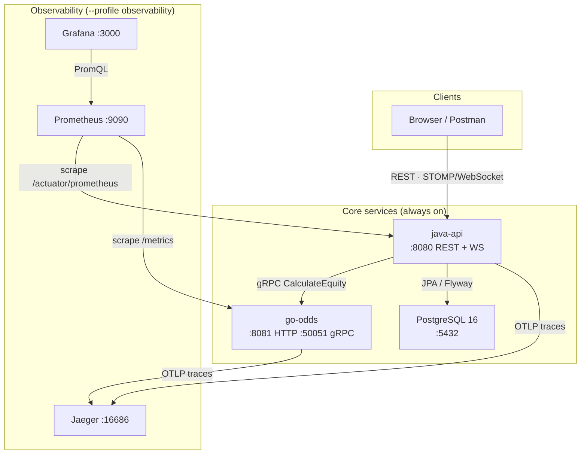

# poker-engine

> Server-authoritative No-Limit Texas Hold'em practice platform — Java + Go microservice showcase

[](https://github.com/pzhiheng/poker-engine/actions)

A **play-money** poker engine with a built-in coach: after every decision the system tells you what the better action would have been and why, backed by Monte Carlo equity simulation.

| Service | Stack | Responsibility |
|---------|-------|----------------|
| `java-api` | Java 21 · Spring Boot 3.5 · Spring Security · JPA · Flyway | REST API, JWT auth, hand state machine, coaching feedback, analytics |
| `go-odds` | Go 1.26 · gRPC · Prometheus · OpenTelemetry | Hand equity (exact + Monte Carlo, concurrent worker pool) |

---

## Quick start

```bash
# 1. Clone
git clone https://github.com/pzhiheng/poker-engine.git
cd poker-engine

# 2. Start the core stack (Postgres 16 + java-api :8080 + go-odds :8081/:50051)
docker compose up --build

# 3. Explore the API
open http://localhost:8080/swagger-ui.html   # interactive Swagger UI
```

> **Observability profile** — start Prometheus, Grafana, and Jaeger alongside the core services:
> ```bash
> docker compose --profile observability up --build
> # Prometheus  → http://localhost:9090
> # Grafana     → http://localhost:3000  (admin / poker)
> # Jaeger      → http://localhost:16686
> ```

---

## Architecture



**java-api** is the single source of truth for table state.
Every action is validated server-side, written to Postgres transactionally, and coaching feedback is computed synchronously before the response is returned.

**go-odds** provides real-time equity calculation at the decision point via gRPC.
It runs Monte Carlo simulations concurrently across `runtime.NumCPU()` goroutines, supports context cancellation, and exposes `/metrics` (Prometheus) and `/health`/`/ready` probes.

---

## API walkthrough

All examples assume `java-api` is running at `http://localhost:8080`. Full spec: `/swagger-ui.html`.

### 1 · Register & login

```bash
# Register alice (returns JWT immediately)
curl -sX POST http://localhost:8080/auth/register \
  -H "Content-Type: application/json" \
  -d '{"username":"alice","password":"alice1234"}' | jq .

# Login to refresh the token at any time
TOKEN=$(curl -s -X POST http://localhost:8080/auth/login \
  -H "Content-Type: application/json" \
  -d '{"username":"alice","password":"alice1234"}' | jq -r '.token')
```

### 2 · Create a table and seat players

```bash
# Create a 5/10 NL table
TABLE_ID=$(curl -s -X POST http://localhost:8080/tables \
  -H "Content-Type: application/json" \
  -H "Authorization: Bearer $TOKEN" \
  -d '{"name":"Demo Table","smallBlind":5,"bigBlind":10}' | jq -r '.id')

# Register bob and get his ID
BOB=$(curl -sX POST http://localhost:8080/auth/register \
  -H "Content-Type: application/json" \
  -d '{"username":"bob","password":"bob12345"}')
BOB_ID=$(echo $BOB | jq -r '.playerId')

# Seat alice at seat 1 (buy-in 500 chips), bob at seat 2
ALICE_ID=$(curl -s http://localhost:8080/auth/login \
  -H "Content-Type: application/json" \
  -d '{"username":"alice","password":"alice1234"}' | jq -r '.playerId')

curl -sX POST "http://localhost:8080/tables/$TABLE_ID/seats" \
  -H "Content-Type: application/json" \
  -H "Authorization: Bearer $TOKEN" \
  -d "{\"playerId\":\"$ALICE_ID\",\"seatNo\":1,\"buyIn\":500}" | jq .

curl -sX POST "http://localhost:8080/tables/$TABLE_ID/seats" \
  -H "Content-Type: application/json" \
  -H "Authorization: Bearer $TOKEN" \
  -d "{\"playerId\":\"$BOB_ID\",\"seatNo\":2,\"buyIn\":500}" | jq .
```

### 3 · Start a hand

```bash
HAND=$(curl -sX POST "http://localhost:8080/tables/$TABLE_ID/hands" \
  -H "Authorization: Bearer $TOKEN")
HAND_ID=$(echo $HAND | jq -r '.handId')
echo $HAND | jq '{handId, street, potChips, myHoleCards}'
# → { "handId": "...", "street": "PREFLOP", "potChips": 15, "myHoleCards": ["Ah","Kd"] }
```

### 4 · Play an action — live coaching feedback

```bash
curl -sX POST "http://localhost:8080/hands/$HAND_ID/actions" \
  -H "Content-Type: application/json" \
  -H "Authorization: Bearer $TOKEN" \
  -d '{"actionType":"CALL","amount":5}' | jq .feedback
```

Response:
```json
{
  "actionTaken": "CALL",
  "recommendedAction": "RAISE",
  "equity": 0.72,
  "potOdds": 0.25,
  "quality": "SUBOPTIMAL",
  "explanation": "You had 72% equity and were only getting 25% pot odds. With this equity advantage, raising for value would have been stronger than just calling."
}
```

**Feedback quality levels:**

| Quality | Colour | Meaning |
|---------|--------|---------|
| `OPTIMAL` | 🟢 Green | Your action matches the recommendation |
| `ACCEPTABLE` | 🟡 Yellow | Slightly off but defensible |
| `SUBOPTIMAL` | 🟠 Orange | A clearly better option existed |
| `MISTAKE` | 🔴 Red | Significant equity lost |

### 5 · Analytics

```bash
# Raw stats (VPIP, PFR, aggression factor, …)
curl -s "http://localhost:8080/players/$ALICE_ID/stats" | jq .

# Full coaching profile (stats + player type + suggestions)
curl -s "http://localhost:8080/players/$ALICE_ID/profile" | jq '{playerType, suggestions}'
```

Player types: `NIT` · `TAG` · `LAG` · `CALLING_STATION` · `FISH` · `MANIAC` · `UNKNOWN`

### 6 · Import hand histories

```bash
# Upload a PokerStars or GGPoker .txt hand history
curl -sX POST http://localhost:8080/import/hands \
  -H "Authorization: Bearer $TOKEN" \
  -F "file=@my_pokerstars_hands.txt" \
  -F "source=POKERSTARS" | jq .

# Poll the import job
curl -s "http://localhost:8080/import/hands/{importId}" | jq .
```

### 7 · Live table viewer (browser)

Open **http://localhost:8080** in a browser.
Paste any `tableId` UUID, click **Connect**, and the page subscribes to
`/topic/tables/{tableId}` via SockJS + STOMP.  
Every hand start and every recorded action broadcasts a `TableEvent` — the page
updates immediately with the current street, pot, and per-seat stacks.

```
ws://localhost:8080/ws   →   /topic/tables/{tableId}
```

Payload (broadcast-safe — no hole cards):
```json
{
  "tableId": "...",
  "handId":  "...",
  "street":  "FLOP",
  "potChips": 30,
  "nextActionSeat": 2,
  "seats": [
    { "seatNo": 1, "username": "alice", "stackChips": 490, "folded": false, "allIn": false },
    { "seatNo": 2, "username": "bob",   "stackChips": 485, "folded": false, "allIn": false }
  ]
}
```

---

## Full API surface

| Method | Path | Auth | Description |
|--------|------|------|-------------|
| POST | `/auth/register` | ❌ | Register + get JWT |
| POST | `/auth/login` | ❌ | Login + get JWT |
| GET | `/tables` | ❌ | List tables (`?status=WAITING`) |
| GET | `/tables/{id}` | ❌ | Table detail + seats |
| POST | `/tables` | ✅ | Create table |
| POST | `/tables/{id}/seats` | ✅ | Seat a player (buy-in) |
| POST | `/tables/{id}/hands` | ✅ | Start a hand |
| POST | `/hands/{id}/actions` | ✅ | Record action + get coaching feedback |
| WS | `/ws` (SockJS) | ❌ | STOMP endpoint; subscribe `/topic/tables/{id}` |
| GET | `/players/{id}/stats` | ❌ | VPIP, PFR, aggression factor, … |
| GET | `/players/{id}/profile` | ❌ | Player type + coaching suggestions |
| POST | `/import/hands` | ✅ | Upload PokerStars / GGPoker history |
| GET | `/import/hands` | ✅ | List import jobs |
| GET | `/import/hands/{id}` | ✅ | Poll import job status |
| GET | `/actuator/health` | ❌ | Health probe |
| GET | `/actuator/prometheus` | ❌ | Prometheus metrics |
| GET | `/v3/api-docs` | ❌ | OpenAPI 3.1 JSON spec |
| GET | `/swagger-ui.html` | ❌ | Swagger UI |
| gRPC | `OddsService.CalculateEquity` | — | Called internally by java-api |
| gRPC | `OddsService.Ping` | — | gRPC liveness probe |

---

## go-odds HTTP endpoints

| Method | Path | Description |
|--------|------|-------------|
| GET | `/health` | Liveness — 200 `{"status":"ok"}` |
| GET | `/ready` | Readiness — 200 when gRPC is up |
| GET | `/metrics` | Prometheus scrape endpoint |

---

## Prometheus metrics

| Metric | Labels | Description |
|--------|--------|-------------|
| `poker_hands_started_total` | — | Hands dealt |
| `poker_hands_finished_total` | `reason=folded\|showdown` | Hands completed |
| `poker_grpc_requests_total` | `method` | go-odds gRPC calls handled |
| `poker_grpc_errors_total` | `method,code` | go-odds gRPC errors |
| Spring Boot auto metrics | — | JVM, HTTP server, Hikari pool, … |

---

## Project structure

```
poker-engine/
├── java-api/                        Spring Boot 3.5 service
│   ├── src/main/java/com/poker/
│   │   ├── config/                  SecurityConfig, GrpcConfig, OpenApiConfig, tracing
│   │   ├── domain/
│   │   │   ├── entity/              JPA entities (8 tables)
│   │   │   ├── model/               Value objects, enums, domain records
│   │   │   └── repository/          Spring Data repositories
│   │   ├── exception/               BusinessRuleException, ResourceNotFoundException
│   │   ├── security/                JwtService, JwtAuthFilter, JwtProperties
│   │   ├── service/                 HandService, AuthService, StatsComputationService,
│   │   │                            PlayerProfileService, HandImportService,
│   │   │                            DecisionEvaluatorService, GrpcEquityProvider
│   │   └── web/
│   │       ├── advice/              GlobalExceptionHandler
│   │       ├── controller/          5 REST controllers (all annotated with OpenAPI)
│   │       └── dto/                 Request / response records
│   └── src/main/resources/
│       ├── application.properties   All config (env-var overridable)
│       ├── static/index.html        Live table viewer (SockJS + STOMP)
│       └── db/migration/            V1__init.sql + V2__analytics.sql (Flyway)
│
├── go-odds/                         Go 1.26 gRPC + HTTP service
│   ├── cmd/server/                  main.go — HTTP + gRPC + OTel + Prometheus
│   ├── internal/
│   │   ├── evaluator/               7-card hand evaluator + Monte Carlo sim
│   │   ├── health/                  /health, /ready HTTP handlers
│   │   ├── odds/                    gRPC OddsService implementation
│   │   └── telemetry/               Prometheus interceptor + OTel tracing
│   └── proto/                       Generated protobuf stubs
│
├── proto/                           odds.proto — shared gRPC IDL
├── docs/
│   ├── seed.sh                      Smoke-test seed script
│   └── prometheus.yml               Scrape config for Compose
├── docker-compose.yml               Core + observability profiles
├── .github/workflows/ci.yml         3-job CI: java-api · go-odds · smoke-test
├── ASSUMPTIONS.md                   Scope freeze
└── CLAUDE.md                        Development standing instructions
```

---

## Testing

```bash
# Java — unit + Testcontainers integration tests
cd java-api
./mvnw test          # unit tests only (no Docker required)
./mvnw verify        # + integration tests (requires Docker / Colima)
./mvnw verify -Pcolima   # same, with Colima socket

# Go — all packages, with race detector
cd go-odds
go test -race -count=1 ./...

# End-to-end smoke test (requires running stack)
POKER_API=http://localhost:8080 docs/seed.sh
```

**Test counts (last push):** 269 Java · 4 Go packages · 0 failures

---

## CI pipeline

Three jobs run in parallel on every push / PR:

| Job | What it does |
|-----|-------------|
| `java-api` | `./mvnw verify` with Postgres service container |
| `go-odds` | `go test -race ./...` + `docker build` |
| `smoke-test` | Builds both services natively, runs `docs/seed.sh` end-to-end |

---

## Design decisions

- **Server-authoritative**: all game logic lives in `HandService`. Clients cannot send fraudulent game state — the server validates every action against its own snapshot.
- **Snapshot model**: each hand action creates a new `HandSnapshot` JSON blob. This makes hand replay trivial and decouples state querying from the mutable entity.
- **Synchronous feedback**: coaching feedback is computed inline with the action response. No separate polling endpoint needed — equity is returned in the same HTTP response as the action outcome.
- **Conditional gRPC**: the `GrpcEquityProvider` bean is activated only when `GO_ODDS_ENABLED=true`. In tests, `StubEquityProvider` returns 0.5 equity without any network calls.
- **W3C trace propagation**: `TraceContextClientInterceptor` injects `traceparent` into outgoing gRPC metadata so Go spans appear as children of Java HTTP spans in Jaeger.
